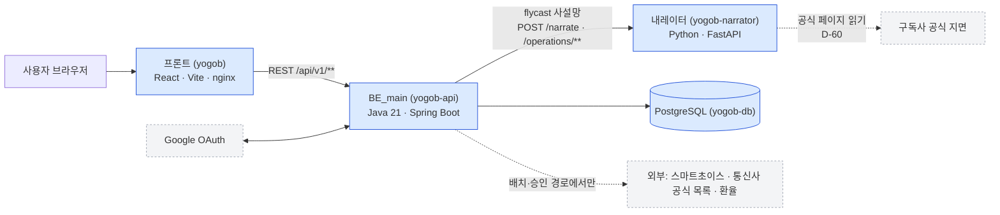
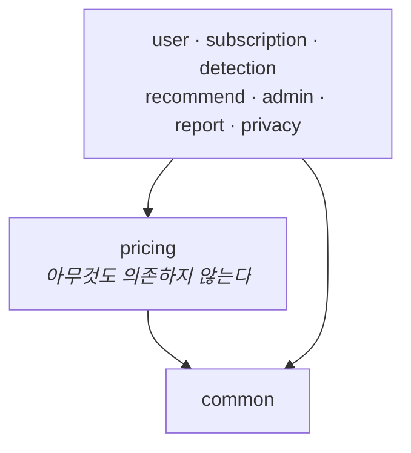

# 아키텍처 · 규약

**§3 API 계약 표는 사람이 관리한다.** 에이전트는 임의 수정 없이 먼저 제안한다.
내레이터 레포(`AI-/docs/contract.md`)에 사본이 있으므로 함께 맞춘다.

---

## 1. 시스템 구성 · 패키지

### 1-1. 시스템 구성



- **BE_main 이 내레이터를 호출한다. 반대 방향은 없다.** 내레이터가 죽어도 결과·계산은 그대로 나간다(D-50).
- **금액은 BE_main 의 `pricing` 만 만든다.** 프론트도 내레이터도 숫자를 만들지 않는다(절대 원칙 2).
- **점선은 사용자 요청 경로가 아니다.** 외부 호출은 배치와 운영자 승인 절차에서만 일어난다(D-05·D-17).

### 1-2. 패키지

```
com.palsaekjo.yogobi
├── pricing/           순수 도메인 — Spring 의존 금지. 금액 계산의 유일한 주체
│   ├── domain/            Money · CostBreakdown · ValuedAmount · PricingContext
│   └── rule/              DiscountRule 구현체
├── catalog/           요금제·구독·혜택 마스터 + 합본 CSV 적재·검수·제안
├── recommend/         조합 탐색 · 추천/계산기 API · 내레이터 클라이언트 · 절감액 표본
├── user/              Google 로그인 · 세션 · 레이트 리밋 · 운영자 계정
├── subscription/      내 구독 · 결제내역 적재
│   └── port/              PaymentHistoryProvider
├── detection/         중복 결제 탐지
├── privacy/           처리방침 · 동의 · 보존기간 파기
├── report/            사용자 제보 · 리워드 쿠폰
├── admin/             백오피스 — 대시보드 · 검수 보드 · 일일 수집 배치
└── common/            예외 · 응답 래퍼 · 퍼널 카운터 · 발신지 판별
```

`chat/`(챗봇)과 `alert/`(알림)은 **없다** — D-44 로 챗봇을 만들지 않기로 했고 알림은 P2 미구현이다.

### 1-3. 의존 방향 (단방향, 위반 금지)



`pricing` 에 Spring 애노테이션·엔티티·리포지토리를 넣지 않는다. 외부 정보가 필요하면
`PricingContext` 에 담아 인자로 넘긴다. **역방향이 생기면 설계가 틀린 것이다.**


### 핵심 인터페이스

```java
public interface DiscountRule {
    boolean applies(PricingContext ctx);
    Money   apply(Money base, PricingContext ctx);
    int     priority();      // docs/domain.md §4
    String  label();         // CostBreakdown 항목명
}

public final class CostCalculator {
    public CostBreakdown calculate(MobilePlan plan, Set<ServiceTier> wanted, PricingContext ctx);
}

public interface PaymentHistoryProvider {   // subscription/port
    List<PaymentRecord> fetch(UserId userId);
}
// 구현: MockMydataProvider, EmlReceiptProvider, ManualEntryProvider
```

---

## 2. 내레이터 경계

| 책임 | BE_main | AI- |
|---|---|---|
| 금액 계산 | ✅ 단독 | ❌ 금지 |
| 조합 탐색 | ✅ | ❌ |
| 결과 → 한국어 문장 | ❌ | ✅ |
| 세션·이력 저장 | ✅ | ❌ 무상태 |

```
POST /api/v1/recommendations  (BE_main)
  → 내부 recommend 호출 (pricing 이 금액을 만든다)
  → 내레이터: POST /narrate  → { message, reasons, notices }   ← 설명만. 실패해도 results 는 그대로 나간다

POST /api/v1/admin/catalog/{dataset}  (운영자 변경 제안, D-29·D-45)
  → 스마트초이스 Open API   → 조건별 추천에서 (통신사, 요금제명) 대조
  → 통신사 공식 목록        → 사업자 전체 목록에서 대조 (D-35, 모델 안 씀)
  → 판정은 BE 가 한다: VERIFIED / MISMATCH(승인 차단) / UNVERIFIED(통과 후 사용자 제보로 보완)

일일 카탈로그 수집 (CatalogDailyHarvest, 매일 09:00 KST)
  → 내레이터: POST /operations/subscriptions/check  → 구독 공식 표기가 (D-60, 모델 안 씀)
  → 대조·제안은 BE 가 한다. 저쪽은 공식 페이지를 읽어 원문을 인용할 뿐 계산도 저장도 하지 않는다
```

### 추천 응답 · 현재 요금제 제외 사유 (D-61, 2026-09-20)

`POST /api/v1/recommendations` 의 `data.current` 에 `excluded` 가 붙는다. **지금 쓰는 요금제가 후보에서
빠졌을 때만** 실리고, 후보였으면 `null` 이다.

```json
"current": { "cost": {...}, "monthlySavings": -14010, "annualSavings": -168120, "semiannualSavings": -84060,
             "excluded": { "reason": "NETWORK", "planDataMb": 6144, "requiredDataMb": 5120,
                           "planNetwork": "FIVE_G", "requiredNetwork": "LTE", "ageLimit": null } }
```

| 필드 | 뜻 |
|---|---|
| `reason` | `INACTIVE` · `DATA` · `NETWORK` · `ELIGIBILITY` 중 하나. 판정 순서는 후보 질의의 WHERE 절과 같다 |
| `planDataMb` · `requiredDataMb` | 비교한 두 값. `DATA` 가 아니어도 사실로서 실린다 |
| `planNetwork` · `requiredNetwork` | 같은 뜻. 사용자가 망을 안 골랐으면 `requiredNetwork` 는 null |
| `ageLimit` | 가입 자격 표기 원문. 없으면 null. 화면은 이 값을 다른 데서 얻을 수 없다 |

- **이 값이 `minimalChange` 가 지금보다 비싸거나 null 인 이유다**(G-51). 화면은 그 표 바로 위에 적는다 —
  `/narrate` 가 아니라 **추천 응답**에 실리는 이유가 그것이다(D-50 이후 설명은 사용자가 펼쳐야 온다).
- **문장은 싣지 않는다.** 사실만 준다 — 문구는 화면·내레이터의 몫이다(D-46·D-47).
- 판정은 후보 질의의 조건을 **한 행에 그대로 적용해** 만든다(`CatalogReader.currentPlanExclusion`).
  자바로 옮겨 적지 않는다 — 사본을 만들면 필터를 고칠 때 조용히 어긋난다. 실제로 프론트에서 그 일이 났다.

### 구독 공식가 조회 (D-60, 2026-09-20)

`POST /operations/subscriptions/check` — 내레이터. `AI-/docs/contract.md` §8 이 사본이다.

| | |
|---|---|
| 요청 | `{ "serviceName": "Spotify" \| "Apple Music" \| "iCloud+" }` |
| 200 | `{ serviceName, sourceUrl, checkedAt, sourceHash, offers[{ tierName, price, currency, billingPeriod, evidence }] }` |
| 502 | `offers` 없이 코드 둘 — `CATALOG-SOURCE-UNAVAILABLE`(못 읽음) · `CATALOG-SOURCE-CHANGED`(읽었는데 한 상품의 월 정가가 유일하지 않음) |

- **URL 을 요청으로 받지 않는다**(SSRF). 주소는 내레이터가 들고 있고, BE 는 응답의 `sourceUrl` 을
  우리 `subscription_service.official_url` 과 **대조해 다르면 그 서비스를 통째로 건너뛴다**(G-48 c).
- `tierName` 은 `subscription_tier.name` 과 글자까지 같아야 붙는다. 안 붙으면 **짝을 지어내지 않는다.**
- **허용 오차 0.** 그 행의 `official_url` 이 가리키는 페이지에서 찍힌 정수를 그대로 읽으므로 반올림이 없다.
- **쿨다운은 BE 가 지킨다.** 내레이터는 부를 때마다 원본 페이지를 읽고 캐시·쿨다운이 없다(무상태 규칙).
  `yogobi.harvest.subscription-cooldown-minutes`(기본 360). 배치는 하루 한 번이지만 운영자가 손으로
  수집을 연타할 수 있고, 그 경로가 곧 원본 페이지 연타다.
- 대상 서비스는 `yogobi.harvest.subscription-services`(기본 `Spotify,Apple Music,iCloud+`).
  **카탈로그 36개 중 3개만 점검된다** — 서비스마다 페이지 문구에 맞춘 추출이 따로 필요해 개수만큼 유지비가 는다.

**BE_main이 AI-를 호출한다. 반대 방향은 없다.** `confidence < 0.7`이면 되묻는다.
내레이터가 죽어도 필터 경로는 정상 동작해야 한다.

프론트는 BE_main API만 호출하며 내레이터와 직접 통신하지 않는다.
프론트 연동 명세는 `docs/BE_API.md`, 내레이터 간 계약은 `AI-/docs/contract.md` 사본과 AI README에서 확인한다.
BE와 AI에 같은 비밀 환경 변수 `NARRATOR_INTERNAL_TOKEN`을 설정하고,
BE가 `Authorization: Bearer <NARRATOR_INTERNAL_TOKEN>`으로 호출한다. 사용자 인증 헤더는 AI에 전달하지 않는다.
내레이터의 `/narrate`·`/operations/**`는 토큰 누락·불일치 시 401, 서버 토큰 미설정 시 503으로 차단한다.
오류 코드는 `NARRATOR-AUTH-001`이고 본문은 `{"detail": {"code", "message"}}` 다 — FastAPI 가 감싸는 모양이며
구독 공식가 조회의 502도 같다(2026-09-20 운영 확인). `/parse`·`/ocr`와 `AI-AUTH-001`은 D-45 로 사라진 옛 표기다.
헬스체크는 토큰 없이 사용한다. 배포 시 AI 접근은 사설망 또는 BE만 허용한 네트워크로 제한한다.
이는 사용자 JWT 인증과 별도이며 내레이터에 사용자 DB·세션을 추가하지 않는다.

### 왜 나눴나 — 핵심 근거

**금액의 신뢰 경계(trust boundary)가 유일한 핵심 이유다.** 요고비의 존재 이유는
"미사용 혜택 0원 + 실제 지불 총액 정확성"이다. LLM은 비결정적이라 같은 조건에 다른 숫자를
내놓을 수 있다(`docs/testing.md`: *"컴파일되지만 금액이 틀린 답을 잘 만든다"*). 그래서
**숫자를 만드는 주체(BE `pricing`)와 말을 만드는 주체(AI)를 물리적으로 분리**한다.

- 금액·조합은 `pricing`(순수 Java, 골든케이스·분기 100%)이 독점한다. **AI는 숫자를 만들지 않는다**
  (절대 원칙 2, D-03). AI가 하는 건 둘뿐: `/parse`(자연어→파라미터), `/narrate`(BE가 계산한 숫자를 문장으로 포장).
- 경계는 코드로 강제된다: `/narrate`의 **금액 문장(`message`)은 LLM을 쓰지 않는 결정론적 템플릿**이고,
  **추천 사유(`reasons`)만 LLM이 만들되 BE가 보낸 금액 외의 금액이 섞이면 그 줄을 버린다**(D-26).
  BE `NarratorClient`가 AI 응답(confidence·정수 GB·서비스 ID·enum)을 **전부 재검증**해 어긋나면 폐기,
  추천 경로가 **하나의 recommend 엔진**을 탄다(원칙 3).

**부수 근거(핵심은 아니지만 정당화):**
- **기술 적합성** — 결정론적 계산은 Java(BigDecimal·타입), 자연어 파싱/생성은 Python/LLM 생태계.
- **Fail-soft** — AI 가 죽어도 추천·계산은 정상이고 결과 설명(`reasons`·`message`)만 빈다.
- **상태 경계** — BE가 세션·이력·DB를 소유, AI는 무상태. 스케일·배포 프로파일이 다르다.
- **독립 반복** — 프롬프트·모델 교체가 계산 엔진을 안 건드린다. 계약(§3)이 유일한 이음새(D-06).

**오해 방지:** 확장성을 위한 마이크로서비스 분해가 아니다(그건 스코프 아웃 — `AGENTS.md`).
"돈 vs 말" 사이에 넘으면 안 되는 정확성 경계 때문에 나눈 것이다. 스케일링은 부산물이지 목적이 아니다.

---

## 3. API 계약

### MVP
| Method | Path | 설명 |
|---|---|---|
| POST | `/api/v1/recommendations` | 무상태 추천 |
| POST | `/api/v1/calculator` | 특정 조합 총비용 |
| GET | `/api/v1/catalog/plans` | 요금제 카탈로그 |
| GET | `/api/v1/catalog/services` | 구독 서비스·티어. 등급에 `currency`(KRW\|USD)·`taxIncluded`·`krwEstimate`·`krwRateDate` — 해외 결제는 환산 **표시만** (아래) |
| GET | `/api/v1/catalog/plans/{id}/benefits` | 요금제별 혜택 |
| POST | `/api/v1/catalog/reports` | 정보 오류 제보(비회원 허용·CSRF 필수), 접수만 수행 — D-18 사용자 요청 |
| POST | `/api/v1/reports` | 상품 없는 제보 — 화면·기능 오류(`SYSTEM`)·기타(`OTHER`). 비회원 허용·CSRF 필수, 접수 + **쿠폰 1장 발급** — D-41·D-42 |
| GET | `/api/v1/me/coupons` | 제보 리워드 쿠폰함 — **회원 전용**. 로그인 상태로 낸 제보만. 조회만 있고 사용 API 는 없다 — D-42 |
| GET | `/api/v1/admin/catalog` | 카탈로그 원본(합본 CSV) 데이터셋 목록·행 수 — **운영자 전용**, D-24 |
| GET | `/api/v1/admin/catalog/{dataset}` | 데이터셋 전체 행 |
| POST | `/api/v1/admin/catalog/{dataset}` | 행 추가 **제안** — 202, 승인 전까지 반영 없음 (D-28) |
| PATCH | `/api/v1/admin/catalog/{dataset}/{key}` | 행 부분 수정 **제안** — 202 |
| DELETE | `/api/v1/admin/catalog/{dataset}/{key}` | 행 삭제 **제안** — 202 |
| GET | `/api/v1/admin/catalog/requests` | 제안 목록. `?status=PENDING\|APPROVED\|REJECTED\|FAILED` |
| POST | `/api/v1/admin/catalog/requests/{id}/approve` | 승인 — **이때 파일·DB에 반영**. 재승인·검토 불일치는 409 (D-29) |
| POST | `/api/v1/admin/catalog/requests/{id}/reject` | 거절 — `{reason}`, 영영 반영하지 않음 |
| GET | `/api/v1/admin/catalog/audit` | 원본 변경 이력(최신순, `?limit=1~500`) — 행위자·시각·전/후 행·결과, D-27 |
| POST | `/api/v1/admin/login` | 백오피스 운영자 로그인 `{id,password}` — 공개, 실패는 401 하나 (D-32) |
| GET | `/api/v1/admin/session` | 관리자 여부 확인 |
| GET | `/api/v1/admin/dashboard` | 사용 지표(회원·카탈로그·검수·제보·엔드포인트) |
| GET | `/api/v1/admin/reports` | **제보 게시판** — `catalog_report`+`service_report` 합본 최신순. `?status=PENDING` · `?limit=`(기본 50·최대 200). **제보자 회원 신원은 싣지 않는다**(D-42) |
| PATCH | `/api/v1/admin/reports/{kind}/{id}` | 처리 상태 변경(`PENDING`·`RESOLVED`·`REJECTED`). `kind` 는 `CATALOG`·`SERVICE`. **원본 카탈로그는 바뀌지 않는다** — 가격 수정은 D-28 승인을 따로 탄다 |
| POST | `/api/v1/admin/harvest/run` | 일일 수집 즉시 실행(정기: 매일 09:00 KST) |

### Phase 1

| Method | Path | 설명 |
|---|---|---|
| POST | `/api/v1/auth/logout` `/logout-all` | 로그아웃 · 이 회원의 모든 로그인 무효화 |
| GET | `/api/v1/auth/csrf` | 회원 변경·비회원 제보 요청용 CSRF 토큰 |
| GET | `/oauth2/authorization/google` → `/login/oauth2/code/google` | **유일한 가입·로그인 경로**(D-34). 콜백 후 `AUTH_RETURN_URL#auth=...` |
| POST | `/api/v1/me/nickname` | 닉네임 변경 — `{nickname}` (D-22) |
| GET | `/api/v1/me` | 인증된 현재 회원 조회 |
| GET/DELETE | `/api/v1/me/sessions` `/{id}` | 로그인 세션 목록 · 개별 세션 폐기 |
| GET/DELETE | `/api/v1/admin/members` `/{id}/sessions` | 회원 운영(D-57 ⑥). 이메일·닉네임 검색, 세션 수·저장 수·구독 수·현재 요금제. **회원 삭제 경로는 없다** — 탈퇴는 본인만. 세션 회수는 `admin_action` 에 남는다 |
| POST | `/api/v1/catalog/gaps` | **공개**(인증·CSRF 없음). 화면에서 못 찾은 것을 결손으로 남긴다(D-56). `{kind, queryText}` → 언제나 `{recorded:true}` — 존재 여부를 알려주지 않는다. 발신지당 15분 60회(`yogobi.catalog.gap-limit`), 1~200자, 기존 10,000행 상한·fail-soft |
| GET/PATCH | `/api/v1/admin/gaps` `/{id}` | 결손 처리 흐름(D-52 ④). 요청 많은 순, 기본은 할 일(REQUESTED·IN_PROGRESS). PATCH `{status, note?}` → `admin_action` 기록 |
| PATCH | `/api/v1/admin/reports/{kind}/{id}` | 제보 상태 + **처리 메모** `{status, note?}`(D-52 ⑤). 목록에 `note`·`updatedAt`·`targetId` 추가 |
| GET | `/api/v1/admin/audit` | 감사 통합 타임라인(D-52 ⑧): `catalog_audit` + `admin_action`(제보·결손 상태, 수동 작업, 파기) 최신순 |
| GET | `/api/v1/admin/dashboard` | + `savings`(우리가 찾아 준 절감액 — 계정당 최신 1건, 중앙값·합계·연 환산·구간 분포·14일 추이, D-54) · `health`(설명 실패 종류별·내레이터 지연·마지막 성공·추천 횟수 vs 사람 수) · `quality`(통신사 표기 중복·등급 중복·더미·출처 없음·MNO 망 결손) · `stats`(7일 1순위 상위·GB 분포·저장 상위) · `funnel.unique`(사람 수, 5단계) + `contaminatedUntil` |
| GET | `/api/v1/stats/savings` | **공개**(인증·CSRF 없음). 랜딩 표본(D-53): `{samples: long[], sampleCount, monthlyAverage, monthlyMedian, basis: "CURRENT_PLAN", updatedAt}` — 1인당 평균·중앙값은 D-57. 계정당 최신 1건 · 최대 30건 · `sampleCount < 5` 면 `samples: []` · 금액 외 식별 정보 없음 · 60초 캐시(`yogobi.stats.cache-seconds`) |
| POST/GET/DELETE | `/api/v1/me/saved-results` `/{id}` | 결과 저장(D-51). 본문은 계산기 요청(`planId`·`tierIds`·`optional`) — **금액은 저장 시점에 BE 가 다시 계산해 스냅숏**으로 둔다. 응답 `{id, savedAt, cost}`, 목록 최신순, 회원당 50개(초과 409), 남의 것은 404, 탈퇴 시 CASCADE |
| GET/POST/DELETE | `/api/v1/me/subscriptions` `/{id}` | 내 구독 (구현) |
| POST | `/api/v1/me/current-plan` | 현재 요금제 설정 (구현) |
| POST | `/api/v1/me/payments/import` | 결제내역 업로드 |
| GET | `/api/v1/me/detections` | 탐지 결과 (구현 — 요청 시 재탐지) |

### Phase 2
| Method | Path | 설명 |
|---|---|---|
| GET | `/api/v1/me/switch-timing` | 변경 시점 (회수기간) — 구현. `?targetPlanId&switchingCost&remainingContractMonths&currentPlanId?`, 현재 요금제(`currentPlanId` > 저장값, G-35)+구독 대비 회수개월·SWITCH_NOW/WAIT/NO_BENEFIT |
| GET | `/api/v1/me/alerts` | 종료 예정 목록 |

### 개인정보 (V5 — 구현)
| Method | Path | 설명 |
|---|---|---|
| GET | `/api/v1/privacy-policy` | 처리방침·처리 인벤토리(공개) — 항목·목적·보유기간·정보주체 권리 |
| DELETE | `/api/v1/me` | 회원 탈퇴 — 일반 이용 데이터 파기·세션 무효화·쿠키 삭제. 법정 보존 사본은 별도 확정 기한 적용 |
| GET | `/api/v1/me/consent` | 내 수집·이용 동의 조회 |
| POST | `/api/v1/me/consent/marketing` | 선택(마케팅) 동의/철회 `{agree}` |
| POST | `/api/v1/me/consent/acknowledge` | 바뀐 처리방침 확인 기록 — **필수 항목만** 현재 버전으로. 마케팅 동의는 승계하지 않는다 (2026-09-17) |

처리방침·인벤토리·보유기간은 `docs/privacy.md`. 보유기간·동의 항목은 정책값이라 확정 시 함께 갱신한다.

### 요청 / 응답

회원 인증 계약(2026-09-10 사용자 승인 1~4): `docs/auth.md`.
추천·계산기·카탈로그 **엔드포인트는 비회원에게 공개한다.** 개인 데이터 저장·관리는 회원 전용이다.
단 **결과 리포트 화면은 로그인 후에만 그린다**(D-36) — 화면 게이트이며 API 권한이 아니다. API 를 직접 부르면 우회되고, 그것을 알고 둔 선택이다.
자체·Google 로그인 모두 동일한 내부 `userId`와 **24시간 JWT**를 사용한다(refresh 없음, 만료 후 재로그인 — D-48, 처음 15분이던 것을 올렸다). JWT는 HttpOnly 쿠키로만 전달하며
별도 브라우저 확인 쿠키와 DB 발급 지문을 함께 검사한다. 회원 요청은 `credentials: include`, 변경 요청은 CSRF 헤더가 필요하다.
자체 가입은 `{name,email,password,nickname?}` 한 번으로 끝난다(D-21). **메일은 쓰지 않는다** — 본인 확인 메일·메일 토큰 가입·메일 재설정
엔드포인트와 `AuthEmail`·`spring-boot-starter-mail`을 2026-09-16 에 제거했다. 이메일 소유는 확인하지 않으며 `email_verified`는 자체 가입에서 FALSE 로 남는다.
**우리는 회원 비밀번호를 보관하지 않는다**(D-34). 그래서 재설정도 복구 코드도 없다 — 계정 복구는 Google 이 한다.
이메일만 같다고 계정을 합치지 않는다. 자체 계정에서 비밀번호 재확인 후 같은 이메일의 Google 계정을 명시적으로 연결한다.
Google 전용 계정은 동일 Google `sub` 재인증으로 자체 비밀번호를 추가한다. 연결 완료 시 기존 세션을 모두 무효화한다.

```jsonc
// POST /api/v1/recommendations
{
  "required": { "monthlyDataGb": 20, "wantedServiceIds": [1, 5],
                "wantedTierIds": [2, 12] },   // 선택 — 비우면 서버가 대표 등급(스탠다드 우선)을 고른다
  "optional": { "currentCarrier": "SKT", "networkType": "5G",
                "contractType": "SELECTIVE_25", "hasFamilyBundle": true,
                "familyLineCount": 3, "familyBundleDiscountKrw": 11000,
                "currentPlanId": 42 }   // 선택 — 지금 쓰는 요금제(G-30). 없는 id 는 400 이 아니라 안내
}
```

```jsonc
// 200
{
  "accuracy": "PARTIAL",
  "missingInputs": [
    { "field": "hasFamilyBundle",
      "impact": "가족 결합 시 최대 11,000원 추가 절감 가능",
      "howToFind": "통신사 마이페이지 > 결합 상품" }
  ],
  "results": [{
    "planId": 42, "planName": "5G 슬림+", "carrier": "SKT",
    "monthlyTotal": 71300, "baseline": 89000,
    "monthlySavings": 17700, "annualSavings": 212400,
    "breakdown": [
      { "label": "5G 슬림+ 기본료", "amount": 55000, "provenance": "OFFICIAL" },
      { "label": "선택약정 25% 할인", "amount": -13750, "provenance": "DERIVED" },
      { "label": "넷플릭스 스탠다드", "amount": 13500, "provenance": "OFFICIAL",
        "note": "제휴 혜택으로 4,000원 할인 적용" }
    ],
    "priceCrossCheck": {                                // 스마트초이스 공식 시세 대조(D-20 1차 교차검증)
      "status": "MATCH",                                // MATCH | MISMATCH | UNVERIFIED | NOT_APPLICABLE
      "officialPrice": 55000,                           // 확인 못 했으면 null (0원으로 적지 않는다)
      "source": "스마트초이스(KTOA)", "sourceUrl": "https://www.smartchoice.or.kr/",
      "checkedAt": "2026-09-16T03:40:00Z"               // 스냅샷을 모은 시각
    }
  }],
  "current": {                                            // currentPlanId 를 줬고 카탈로그에 있을 때만. 없으면 null
    "cost": { "planId": 7, "planName": "5G 언리미티드", "carrier": "SKT", "monthlyTotal": 82300, "…": "results 와 같은 모양" },
    "monthlySavings": 11000,                              // current − results[0]. 지금이 더 싸면 음수 그대로
    "annualSavings": 132000
  },
  "minimalChange": { "planId": 7, "planName": "5G 슬림+", "carrier": "SKT", "…": "results 와 같은 모양" },
                                                          // D-55: 번호이동 없이 요금제만 바꾸는 선택지(현재 통신사 안 최저).
                                                          // 현재 통신사를 모르거나 그 통신사에 후보가 없으면 null
  "candidateCount": 127,                                  // 정렬 대상 후보 수. results 는 상위 N개만
  "message": null, "reasons": [], "notices": []           // D-50: 추천 본체는 설명을 싣지 않는다 — 아래 /narrate
}
```

```jsonc
// POST /api/v1/recommendations/narrate — 같은 요청 본문. 사용자가 "설명 보기"를 펼칠 때 프론트가 부른다(D-50, 2026-09-18)
// 200
{
  "message": "“SKT 5G 슬림+”의 실제 내시는 금액은 …",     // 1순위 설명. 모델 키 없이 나온다. 내레이터 장애면 null
  "reasons": [                                            // 1순위 조합에 대한 사유, 0~3개
    "따로 내시던 넷플릭스 스탠다드 13,500원이 요금제에 포함돼 있어요.",
    "선택약정 25% 할인으로 월 13,750원이 빠져요."
  ],
  "notices": ["가족 결합 중이라면 할인액을 알려주세요 — 통신사 마이페이지 > 결합 상품"]   // ⓘ 안내 0~10줄
}
```
추천을 다시 계산해 1순위를 설명한다(무상태·저장 없음). 후보가 없으면 셋 다 빈 값이다. 공개·CSRF 면제는 추천과 같다.
**결과와 설명을 나눈 이유**: 하루에 설명 경로 사고가 넷이었고(허용 목록·미배포·422·줄바꿈) 그때마다 결과 화면이
내레이터 지연·장애를 같이 맞았다. 이제 결과는 내레이터와 무관하고, 첫 응답이 내레이터 왕복만큼 빨라진다.

`breakdown[].provenance` 는 `Provenance` enum 4값이다: `OFFICIAL`·`DERIVED`·`USER_PROVIDED`·`ESTIMATED`.
가족결합 할인은 `USER_PROVIDED` 다(G-28). 내레이터는 값을 열거로 묶지 않는다 — 2026-09-18 에 `USER_PROVIDED` 가
빠져 있어 결합 사용자 전원의 설명이 422 로 비었다.
`baseline`은 아무 할인 없이 정가로만 냈을 때다. 절감액 표시의 기준선.
`semiannualSavings`(= `monthlySavings` × 6)는 `CostResult`·`current` 둘 다에 있다(D-51, 결과 대시보드의 1·6·12개월 탭). 화면이 곱하지 않도록 BE 가 준다. `/narrate` 요청에는 싣지 않는다.
`minimalChange`는 **번호이동 없이 요금제만 바꿀 때** 가장 싼 조합이다(D-55). 화면의 '변경 최소' 열이 이것이고,
`results[0]`(전체 최저가)과 같을 수 있다 — 지금 통신사가 이미 가장 싸다는 뜻이다. 현재 통신사는 `current` 와 같은 규칙으로 정한다.
`current`는 **지금 쓰는 요금제로 같은 구독을 유지했을 때**의 금액이다(G-30). 후보와 같은 계산기·같은 컨텍스트로 내므로
`results[0]`과 나란히 놓고 빼도 되는 두 금액이며, 그 뺄셈도 여기서 해서 보낸다 — 화면은 금액을 만들지 않는다(원칙 2).
`familyBundleDiscountKrw`는 **현재 통신사의 요금제에만** 반영한다(G-29). 통신사를 옮기면 결합이 풀려 사라질 할인이라,
다른 통신사 후보에 빼면 갈아탄 뒤 그만큼 더 내게 된다. 현재 통신사는 `currentPlanId`의 통신사 > `currentCarrier` 순으로 정하고,
둘 다 없으면 **어디에도 적용하지 않는다.**
D-18에서 우체국·스마트초이스 연동과 `priceCrossCheck` 응답 필드를 제거했다.
**2026-09-16 사용자 승인으로 `priceCrossCheck`를 복구했다**(D-12 마지막 줄이 남겨 둔 §3 계약 결정).
대조 대상은 요금제 **기본료**이며 `baseline`(구독 포함 정가 합계)이 아니다.
`status`는 네 값이다. `UNVERIFIED`는 **"틀렸다"가 아니라 "확인 못 했다"**이고,
`NOT_APPLICABLE`은 **스마트초이스가 그 통신사를 아예 주지 않아 대조 대상이 아니다**라는 뜻이다.
실측 응답의 통신사는 `SKT·KT·LGU+` 뿐이라 알뜰폰 요금제(카탈로그 1,711건 중 1,451건)가 여기 해당한다
(evidence/smartchoice-operation-2026-09-16.json). 둘을 합치면 화면이 알뜰폰 사용자에게 영영 오지 않을
"확인"을 기다리게 만든다.
통신사 표기는 소문자·공백 제거 후 비교한다 — 카탈로그 `LG U+` 와 응답 `LGU+` 가 달라 88건이 전부 실패했다.
값은 **표시·신뢰용이며 금액에도 추천 순위에도 넣지 않는다**(D-03). 서비스는 정렬이 끝난 뒤에 붙인다.
채우는 값의 출처는 배치가 모은 `smartchoice_plan_snapshot` 뿐이다 — 요청 경로는 외부를 호출하지 않는다(D-05 유지).
`SMARTCHOICE_API_KEY`가 없으면 스윕이 돌지 않아 전 결과가 `UNVERIFIED`다(fail-soft).
D-26에서 AI `/narrate` **응답**에 `reasons`를 더했다. 요청 필드는 그대로다.
D-26 후속(2026-09-16): BE가 `/narrate`를 호출해 `reasons`를 `/recommendations` 응답 최상위에 싣는다.
1순위 결과(`results[0]`)에 대한 사유를 담으며, AI 장애 시에도 `results`는 정상이다.
narrate 오케스트레이션은 컨트롤러가 한다(`RecommendationController`·`ChatController`) — `RecommendationService`는 AI를 모른다.
`recommend`가 `chat`의 `NarratorClient`에 직접 의존하면 순환이 되므로 포트 `recommend.Narrator`(구현: `NarratorClient`)로 역전한다.

**`/narrate` 요청에 싣는 필드는 아래 10개뿐이다**(`NarratorClient.NARRATE_FIELDS`):
`planId`·`planName`·`carrier`·`monthlyTotal`·`baseline`·`monthlySavings`·`annualSavings`·`breakdown`·`missingInputs`·`candidateCount`·`currentMonthlyTotal`·`currentMonthlySavings`(뒤 둘은 선택, 같이 온다).
`currentMonthlyTotal` 은 응답 `current.cost.monthlyTotal`, `currentMonthlySavings` 는 `current.monthlySavings` 이며 `currentPlanId` 를 받았을 때만 싣는다 — 있으면 내레이터가 "지금보다" 기준으로 말하고 없으면 정가 기준이다(2026-09-18 사용자 승인. 히어로와 문장이 어긋나던 것을 맞춘다). 절감액을 같이 보내는 이유는 내레이터가 두 수를 빼지 않게 하려는 것이다(절대 원칙 2). 두 값이 어긋나면 내레이터는 정가 기준으로 물러난다.
`candidateCount`는 `CostResult`에 없어 컨트롤러가 따로 싣는다. **기준 카탈로그 1,706개 중 1,645개는
제휴 혜택도 약정할인도 없어 절감액이 0이다** — 그런 요금제에는 "몇 개 중에서 골랐나"가 유일한 근거다.
`CostResult`를 통째로 직렬화하면 AI가 쓰지 않는 필드까지 나간다 — 복구된 `priceCrossCheck`가 실제로 그랬다.
내레이터는 계약 밖 필드를 **422로 거부**하고 BE는 그것을 장애로 삼키므로, 사유가 화면에서 조용히 사라진다.
레코드에 필드를 더하면 이 목록에 적을지 먼저 정한다. 적지 않으면 AI로 가지 않는다.

```jsonc
// 내레이터: POST /narrate 200
{
  "message": "“SKT 5G 슬림+”의 실제 내시는 금액은 월 71,300원이에요. ...",  // 고정 템플릿
  "reasons": [                                                            // 0~3개. 규칙이 만든다
    "따로 내시던 넷플릭스 스탠다드 13,500원이 요금제에 포함돼 있어요.",
    "선택약정 25% 할인으로 월 13,750원이 빠져요."
  ],
  "notices": [                                                            // 0~10개. 화면 ⓘ 안내 (D-46)
    "가족 결합 시 최대 11,000원 추가 절감 가능 — 통신사 마이페이지 > 결합 상품"
  ]
}
```

`notices`는 `missingInputs`의 `impact`·`howToFind`를 **고쳐 쓰지 않고 이은 것**이다(D-46). 화면이 조립하던 것을
서버로 모아 표현이 갈라지지 않게 한다. 300자를 넘는 줄은 자르지 않고 통째로 뺀다 — 잘린 안내는 오해를 만든다.

```jsonc
// 내레이터: POST /narrate/detections 200  (D-46)
// 요청 { "findings": [{ "rule", "targetName", "wastedAmount", "provenance" }] }
{
  "lines": [{ "title": "요금제에 포함된 구독을 따로 결제 중", "target": "넷플릭스",
              "amount": "월 13,500원",            // ESTIMATED 면 "최대 월 13,500원"
              "how": "요금제 혜택으로 이미 제공돼요. 개별 결제를 해지하면 그만큼 줄어요." }],
  "summary": "겹치는 결제 1건을 찾았어요. 해지·변경은 각 서비스에서 직접 해주세요 — 요고비는 금액만 알려드려요."
}
```

대상 이름은 **BE가 카탈로그에서 찾아 넘긴다** — 내레이터는 카탈로그를 모른다. 모르는 규칙 코드는 제목에
그대로 두고 `how`를 비운다. 새 규칙이 화면에서 조용히 사라지지 않게 하기 위해서다.
요약은 **건수만** 말한다. 금액을 더하는 순간 계산이고 계산은 `pricing` 몫이다(절대 원칙 2).

`reasons`는 화면의 "왜 나에게 이 상품이 추천됐나요?" 목록을 채운다. 보조 정보이므로 **비어 있을 수 있다.**
**모델 장애 시에는 내레이터가 규칙으로 만든 사유가 내려간다**(D-38, 사용자 승인 2026-09-17).
요청의 `breakdown`만 읽어 만들며 모델 문장과 **같은 금액 가드**를 통과하므로 나가는 규칙은 하나다.
근거가 없으면 빈 배열도 여전히 가능하다. `message`와 추천 결과는 그 경우에도 정상이다.
**`message`도 `/recommendations` 응답에 실어 결과 화면이 그대로 렌더링한다**(사용자 승인 2026-09-17).
`message`는 LLM을 쓰지 않는 템플릿이라 **모델 키 없이도 나온다.** BE가 AI에 아예 닿지 못하면 `null`이고
화면은 자체 최소 문구로 대체한다. 화면은 금액을 문장으로 다시 쓰지 않는다 — 숫자를 만드는 곳은 하나다.
AI는 요청의 `breakdown`·`missingInputs`에 **실제로 있는 금액만** 인용하며, 그 밖의 금액이 섞인 줄은 내레이터가 폐기한다.
`breakdown`에 없는 항목은 근거로 쓰지 않으므로 **미사용 혜택은 사유 문장에도 등장하지 않는다**(절대 원칙 1).
카탈로그 원본은 검수·승인된 CSV이며 PostgreSQL에 반영된 값으로 계산한다. 발행·복구 절차는 `docs/catalog-data.md`,
제보 요청·응답 상세는 `docs/BE_API.md`를 따른다. 제보는 카탈로그를 직접 수정하지 않는다.

```jsonc
// GET /api/v1/catalog/services 200 — 등급(tier) 스키마 (사용자 결정 2026-09-16)
{ "id": 2,  "name": "스탠다드", "price": 13500, "currency": "KRW", "taxIncluded": true,
  "krwEstimate": null,  "krwRateDate": null },
{ "id": 94, "name": "Pro",      "price": 20,    "currency": "USD", "taxIncluded": false,
  "krwEstimate": 29901, "krwRateDate": "2026-09-15" }   // 환율 환산 + 부가세 10% — ESTIMATED
```

`price`는 **`currency` 단위의 공식 표기 금액**이다. `taxIncluded=false` 면 표기가가 세금 별도라는 뜻이고
(해외 사업자 관행 — 한국 이용자는 결제 시 부가세 10%가 더 붙는다) `krwEstimate` 에 그 10%가 반영돼 있다.
**표기가에 세금을 섞어 저장하지 않는다** — 공식 표기가가 출처다. 해외 결제 등급은 원화 확정 금액이 없으므로
`krwEstimate`(환산)와 기준일 `krwRateDate`를 함께 주고, 원화 등급은 두 필드가 `null`이다.
환율은 **하루 1회 배치**로만 갱신하며(요청 경로에서 외부 호출 없음 — D-05) 값이 없으면 환산도 `null`이다. 0원으로 적지 않는다.
**환산값은 표시 전용이다**(D-17): `/recommendations`·`/calculator`는 원화 확정 등급만 계산에 넣고,
빠진 서비스·등급은 400이 아니라 `missingInputs`로 알린다. 계산에 들어가는 유일한 원화 금액은
사용자가 확인해 넣은 `user_subscription.monthly_price`(`USER_PROVIDED`)다. 골든 케이스는 `docs/testing.md` G-17.

---

## 4. DB 스키마

> **전체 ERD 는 [`docs/erd.md`](erd.md) 에 있다**(테이블 29개, 영역별 다이어그램).
> 아래는 단계별 도입 이력이라 지금 모양과 다를 수 있다 — 현재 스키마는 ERD 와 마이그레이션이 옳다.

### MVP
| 테이블 | 주요 컬럼 |
|---|---|
| `carrier` | id, name, carrier_type |
| `mobile_plan` | id, carrier_id, name, network_type, base_price, data_mb, voice_min*, sms_cnt*, contract_discount_12m, contract_discount_24m, source_url (*는 미확인 시 NULL, V11) |
| `subscription_service` | id, name, category, official_url |
| `subscription_tier` | id, service_id, name, price, concurrent_streams, quality |
| `plan_benefit` | ↓ |
| `bundle_product` / `bundle_item` | id, name, price / bundle_id, tier_id |
| `merchant_alias` | id, service_id, pattern, match_type |

```sql
CREATE TABLE plan_benefit (
    id              BIGSERIAL PRIMARY KEY,
    mobile_plan_id  BIGINT NOT NULL REFERENCES mobile_plan(id),
    service_id      BIGINT NOT NULL REFERENCES subscription_service(id),
    tier_id         BIGINT REFERENCES subscription_tier(id),
    benefit_type    VARCHAR(20) NOT NULL,   -- FREE|FIXED_DISCOUNT|RATE_DISCOUNT|BUNDLE_INCLUDED
    discount_value  NUMERIC(10,2),
    is_exclusive    BOOLEAN NOT NULL DEFAULT FALSE,
    exclusive_group VARCHAR(50),
    valid_from      DATE,
    valid_to        DATE,
    source_url      TEXT
);
CREATE INDEX idx_plan_benefit_plan ON plan_benefit(mobile_plan_id);
```

### Phase 1 (V2 마이그레이션)
`app_user`(id, email, password_hash, **current_plan_id** → mobile_plan, created_at)
— `user` 는 PostgreSQL 예약어라 `app_user`. `current_plan_id` 는 BENEFIT_OVERLAP 탐지에 쓰는 현재 요금제.
· `user_subscription`(user_id, tier_id, started_at, ended_at, monthly_price, last_used_at)
· `payment_record`(user_id, merchant_raw, service_id nullable, amount, paid_at, source)
· `detection_result`(user_id, rule_code, target_ref, wasted_amount, detected_at)

### Phase 2 (스키마만 선반영)
`contract` · `promotion` · `alert_schedule`

### 회원 인증 (V3·V4 마이그레이션)
`app_user.password_hash`는 Google 전용 회원에서 null 가능, `google_sub`는 UNIQUE, 정규화 이메일 UNIQUE, 로그인 수단 최소 1개.
V4에서 `email_verified`(자체 가입은 검증 토큰 소비 시 TRUE), `credential_version`(비밀번호·연결 변경 시 증가 → 이전 발급 토큰 무효화 기준) 추가.
`auth_session`(token_hash PK, user_id FK, binding_hash, expires_at + V4: id UUID, created_at, last_seen_at, user_agent):
원문 JWT·브라우저 확인값은 저장하지 않고 SHA-256 지문만. 24시간 만료·2시간 유휴로 정리하며(D-48) `/me/sessions`로 조회·폐기한다.
`auth_email_token`(token_hash PK, purpose SIGNUP|RESET, email, user_id, credential_version, expires_at): 10분·단일 사용 본인 확인 토큰.
이메일별 트랜잭션 잠금 후 소비해 동시 링크 정리의 교착을 방지한다.
자격 증명 변경과 세션 발급은 회원 행/버전을 검사하며 재설정 전 로그인 결과의 뒤늦은 발급을 차단한다.
`mobile_plan.network_type` 는 `FIVE_G`·`LTE`·`THREE_G`·**`LTE_5G`**(통합요금제, D-58)다. 통합은 5G·LTE 어느 쪽을 골라도 후보이고 3G 에는 걸리지 않는다. CSV 표기는 `5G/LTE`.
`auth_rate_limit`(bucket PK, expires_at, attempts): IP **2,000**(`yogobi.auth.ip-limit`)·이메일 로그인 10·재인증 10·메일 3, 15분 창. 만료 행은 요청 시 정리.
IP 버킷 키는 프론트 nginx 가 넘기는 `X-Client-IP`(Fly 엣지가 준 진짜 발신지)이고, 없으면 TCP peer 다(H-1, 2026-09-18). peer 는 프록시 뒤라 **전 사용자가 한 값**이라 40 이던 때는 정상 사용자 41명이면 전원 429 였다. `X-Forwarded-For` 는 안 본다(누적 헤더라 첫 값을 사용자가 정한다). 직접 호출자가 `X-Client-IP` 를 지어내면 자기 버킷만 쪼개질 뿐 남을 막지 못한다.

### 개인정보 (V5 마이그레이션)
삭제권(파기): V2 개인 테이블(`user_subscription`·`payment_record`·`detection_result`) FK에 `ON DELETE CASCADE` 부여.
`DELETE app_user`로 일반 이용 데이터가 파기된다(auth_session·auth_email_token은 V3/V4에서 이미 cascade). V6의 별도 법정 보존 사본은 이 FK 경로에 연결하지 않는다.
`user_consent`(id, user_id FK cascade, item `ESSENTIAL|MARKETING`, policy_version, agreed_at, withdrawn_at, UNIQUE(user_id,item)):
필수는 가입 시 자동 기록(계약 이행), 선택은 `/me/consent/marketing`로 동의/철회. 보유기간 초과분은 `RetentionService`가 파기.

### 법정 보존 예외 (V6, 2026-09-12 팀원 리뷰 반영)
`payment_record`는 사용자 반입 외부 구독 분석 내역이며 CASCADE·12개월 보유 정책을 유지한다.
법정 의무가 확인된 예외 사본만 `retained_payment_record`에 분리 저장한다. 원본 거래 ID·가맹점·서비스·금액·결제일·출처,
`legal_basis`·`retention_start`·`retain_until`·저장 시각을 보관하며 회원 ID·이메일·인증 정보·회원/원본 FK는 없다.
`PaymentRetentionService.preserve`는 원본 생성/분류 트랜잭션에서 명시적으로 호출하고, 일반 반입/탈퇴가 자동으로 사본을 생성하지 않는다.
`RetentionService`는 사본의 확정 기한에만 파기한다. 회원 API·추천·AI에 사본 접근 경로 없음. 익명화를 보장하지 않으며 상세 조건은 `docs/privacy.md`.

### CSV 운영·정보 오류 제보 (V9, D-18)
V7의 `smartchoice_plan_snapshot`은 V9에서 제거한다. 기존 Flyway V7 파일은 적용 이력 때문에 유지한다.
`mobile_plan`·`subscription_service`·`subscription_tier`·`bundle_product`에 `active`를 추가한다.
CSV에 없는 상품은 비활성화하며 기존 회원 FK를 보존한다. 신규 카탈로그 조회·추천·선택은 활성 상품만 허용한다.
`CatalogCsvSync`는 승인 해시를 확인한 5종 전체 CSV를 단일 DB 트랜잭션으로 반영한다. 실패하면 이전 DB를 유지한다.
`catalog_report`는 UUID, 대상 종류/ID, 오류 항목, 설명, 선택 출처 URL, 상태, 생성 시각을 저장한다.
회원 ID·이메일·원문 IP를 수집하지 않으며 제보 본문은 90일 경과 후 정기 파기한다.

### 제보 리워드 쿠폰 (V24, D-42)
`service_report`에 `user_id`(비로그인은 NULL)와 `coupon_used_at`을 더한다. **제보 1건 = 쿠폰 1장**이라
별도 표도, 별도 코드 칼럼도 두지 않는다 — **제보 id가 곧 쿠폰 코드**다.
`user_id`는 `ON DELETE SET NULL`이다. 탈퇴하면 제보 본문은 남기고 귀속만 끊는다 — 본문은 우리 버그 기록이지
회원의 개인정보가 아니다(설명란에 개인정보를 적지 말라고 받는다). 다른 표가 CASCADE인 것과 갈리는 지점이다.
**이 쿠폰이 지금 해제하는 것은 없다.** 요금 분석은 무료이고 수익 모델은 범위 밖이다(D-01).
그래서 사용 API를 만들지 않았다. 보유기간은 제보와 같아 90일에 함께 파기된다.

### 카탈로그 결손 기록 (V10)
`catalog_candidate`는 추천에서 찾지 못한 서비스 ID·요금제 조건의 요청 횟수를 기록한다. 금액 계산에 쓰지 않는다.
기존 정보 정정용 `catalog_report`와 별도이며, 실제 AI 수집·검증 작업의 실행기는 아직 연결하지 않았다.

### 초기 구현 범위 (D-07)
V1은 위 MVP 테이블 8개를 생성한다. P1/P2 테이블은 해당 단계에서 새 마이그레이션으로 추가한다.
시드 원문 보존을 위해 `subscription_tier.note`, `bundle_product.provider`를 저장하고,
`mobile_plan`에 `age_limit`·`collected_at`, `plan_benefit`에 `collected_at`을 둔다.
시드 3종의 적재 방식은 `db/seed/README.md`를 따른다.

---

## 5. 개발 규약

### 커밋
```
feat(pricing): 선택약정 25% 할인 규칙 추가
fix(detection): 번들 중복 판정에서 비활성 구독 제외
```
타입 `feat|fix|refactor|test|docs|chore`, 스코프는 패키지명. 본문에 **왜**를 쓴다.
커밋 author·메시지에 AI 귀속 흔적(에이전트 태그·`Co-Authored-By`)을 남기지 않는다. author 는 `winwinhun`.

### 브랜치
`main`(항상 동작) + `feat/<주제>`(하루 안에 머지). GitFlow는 과하다.

### 마이그레이션
Flyway `db/migration/V{n}__{설명}.sql`.
`funnel_daily(day, kind, count)` — D-36 로그인 게이트 퍼널 일별 집계(V20). 개인 식별값이 없어 보유기간 판단 대상이 아니다. micrometer 는 인메모리라 Fly auto_stop 에 리셋돼 쓸 수 없다.
**적용된 파일을 수정하지 않는다.** 새 파일을 추가한다.
시드는 마이그레이션이 아니라 `db/seed/*.csv` + 로더로 넣는다.

### 에러 코드
| 코드 | 의미 | HTTP |
|---|---|---|
| `YGB-REQ-001` | 필수 입력 누락 | 400 |
| `YGB-CAT-001` | 요금제 없음 · 카탈로그 원본의 행/데이터셋 없음(D-24) | 404 |
| `YGB-CAT-002` | 카탈로그 원본 행 충돌 — 키 중복·키 필드 변경 시도(D-24) | 409 |
| `YGB-CAT-503` | 카탈로그 원본 파일 경로 미설정 — **편집만** 불가(조회는 됨). `yogobi.catalog.combined-csv` 가 비면 발생 (2026-09-17) | 503 |
| `YGB-CAL-001` | 계산 가능한 조합 없음 (D-17 이후 미사용 — 추천의 후보 0건은 200+`missingInputs`) | 422 |
| `YGB-IMP-001` | 결제내역 파일 형식 오류 | 400 |
| `YGB-IMP-002` | 인식 불가 가맹점 포함 | 200 + 경고 |
| `YGB-EXT-001` | 외부 API 실패 | 200 + 경고, **추천은 정상 반환** |

```json
{ "data": {...}, "warnings": [{ "code": "...", "message": "..." }] }
{ "error": { "code": "...", "message": "...", "field": "..." } }
```

### 환경 변수
`.env.example`을 커밋하고 `.env`는 gitignore. **API 키를 코드·문서에 적지 않는다.**

### Definition of Done
1. 골든 케이스 또는 단위 테스트 green
2. API를 추가했으면 §3 표 갱신 (+ AI- 레포 사본)
3. **API 요청/응답이 바뀌면 `docs/BE_API.md`(프론트 참고본) 갱신**
4. 새 개념을 만들었으면 `docs/domain.md` §2에 등록
5. `docs/state.md` 갱신
6. `docker compose down -v && up`으로 처음부터 재현

6번이 자주 빠진다. 내 로컬 DB에만 있는 데이터로 동작하면 완료가 아니다.
