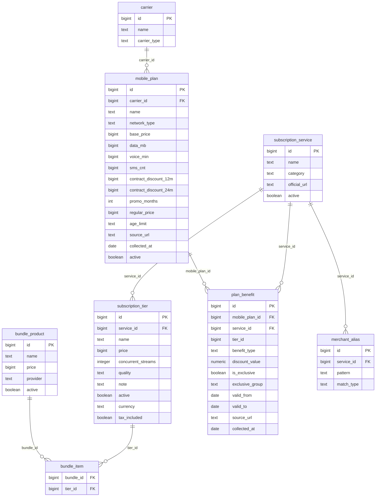
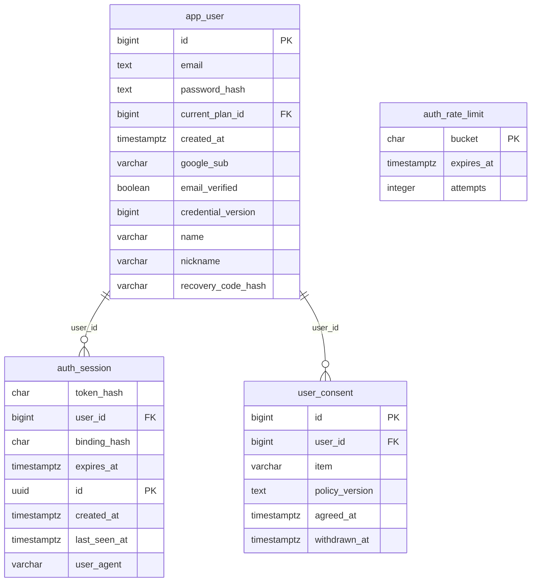
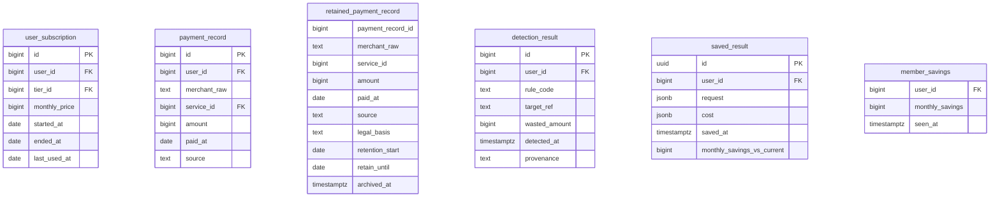
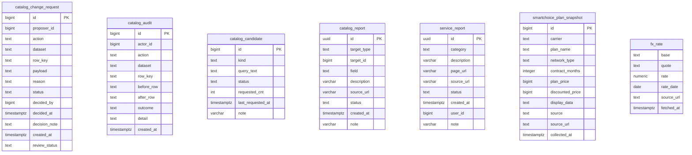
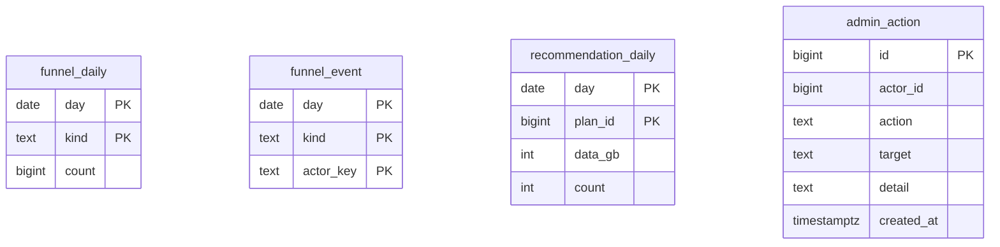

# DB ERD

> **마이그레이션에서 재구성해 손으로 묶었다.** 원본은 `db/migration/V*.sql` 이고, 이 문서와 어긋나면
> 마이그레이션이 옳다. 최종 확인 **2026-09-21 · V1~V33 · 테이블 29개**.
>
> 제약(CHECK·UNIQUE)과 인덱스는 싣지 않았다 — 그림이 읽히지 않는다. 필요하면 마이그레이션을 본다.

**읽는 순서**: 카탈로그(금액이 어디서 오나) → 회원·인증 → 회원 데이터 → 운영·수집 → 지표.

| 이 스키마가 지키는 약속 | |
|---|---|
| 금액 | `BIGINT` **원 단위**. `double`/`float` 를 쓰지 않는다 |
| 구독 등급 가격 | **전부 월 단가다.** 연간 총액이 한 줄 섞이면 그 사용자의 월 총액이 12배가 된다(G-54) |
| 카탈로그 삭제 | 지우지 않고 `active=false` 로 내린다 — 이미 고른 회원의 참조가 끊기면 안 된다(G-53) |
| 회원 탈퇴 | 회원 데이터는 `ON DELETE CASCADE` 로 함께 사라진다(D-11) |
| 출처 | 카탈로그 행은 `source_url`·`collected_at` 을 들고 다닌다(절대 원칙 4) |

## 카탈로그 — 금액의 원천

합본 CSV(`db/seed/catalog_combined.csv`)가 원본이고 이 표들은 그 투영이다(D-18). 요청 중 외부 가격 조회는 하지 않는다(D-05).

**기간 한정 특가**(V32, 2026-09-21). `promo_months` 는 특가가 유지되는 개월 수이고 NULL 이면 특가가
아니다. `regular_price` 는 **"N개월 이후 B원/월" 의 B** 다 — 이름과 달리 "정가"가 아니고, 13건 중
5건은 이 값이 `base_price` 보다 **싸다**(장기할인·약정형). NULL 이면 <b>확인하지 못했다</b>는 뜻이고
그때는 그 기간의 절감액을 숫자로 내지 않는다. 추정값을 넣지 않는다(D-43).

`base_price` 의 뜻은 바꾸지 않았다 — **지금(1개월차) 내는 금액**이다. 기존 계산·정렬이 전부 이 값을
쓰므로 의미를 바꾸면 순위가 통째로 흔들린다.

**등급 이름의 유일성은 활성 행에만 걸린다**(V33, 2026-09-21). `subscription_tier` 의
`UNIQUE (service_id, name)` 이 비활성 행에도 걸려 있어, 합본에서 내린 등급이 그 이름을 영원히
점유했다 — 이름을 재사용하려다 **운영이 5분 죽었다**. 부분 유니크 인덱스로 바꿔 퇴역 행은 이름을
간직하되 점유하지 않는다. 예전에 그 id 로 저장한 결과도 같은 이름으로 읽힌다.

## 회원·인증

로그인은 Google 하나뿐이다(D-34). 세션은 절대 24시간·유휴 2시간이고 DB 행이 곧 세션이다(D-48).

## 회원 데이터

탈퇴하면 회원 행과 함께 사라진다(D-11). 법정 보존 의무가 확인된 증빙만 `retained_payment_record` 로 분리한다.

## 운영·수집

외부 조회는 배치와 승인 절차에서만 일어난다(D-05·D-20). 수집 결과는 **제안**이 되고 사람이 승인한다(D-28).

## 지표·감사

**사람 수와 횟수를 나눠 센다**(D-52) — 무한 호출 사고가 나도 사람 수는 안 부푼다. 운영자가 한 일은 `admin_action` 에 남는다.

`kind` 는 `funnel_daily` 에 CHECK 로 고정돼 있다 — 오타가 새 단계처럼 보이면 안 되기 때문이다.
현재 허용값 7종(V31, 2026-09-21): `GATE_SHOWN` · `REPORT_SHOWN` · `MEMBER_LOGIN` ·
`CALENDAR_SHOWN` · `RESULT_SAVED` · `INPUT_STARTED` · `INPUT_COMPLETED`.
**단계를 늘릴 때 이 CHECK 를 같이 넓혀야 한다.** 안 넓히면 기록이 조용히 버려진다 —
집계 실패는 삼켜지도록 되어 있어(기능이 지표 때문에 멈추면 안 된다) 화면에서 "아무도 안 했다"와
구분되지 않는다. 실제로 그렇게 사흘을 잃었다(G-57 f 가 이제 그걸 막는다).

`day` 는 **한국시간 기준**이다(D-63). 2026-09-21 이전 행은 UTC 기준이라 그 지점에 이음매가 있다.

## 영역을 가로지르는 참조

| 참조하는 쪽 | 참조되는 쪽 |
|---|---|
| `app_user.current_plan_id` | `mobile_plan` |
| `user_subscription.user_id` | `app_user` |
| `user_subscription.tier_id` | `subscription_tier` |
| `payment_record.user_id` | `app_user` |
| `payment_record.service_id` | `subscription_service` |
| `detection_result.user_id` | `app_user` |
| `saved_result.user_id` | `app_user` |
| `member_savings.user_id` | `app_user` |
