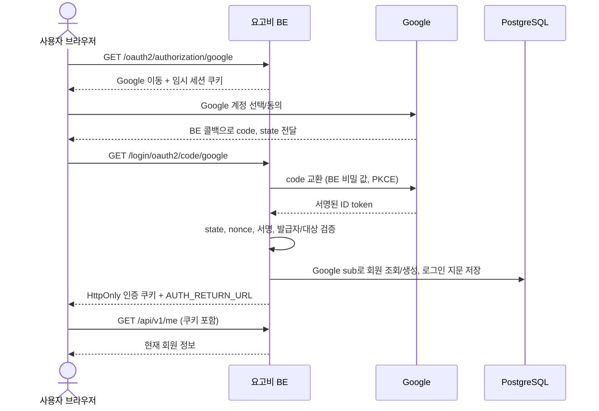

# Google OAuth 연동 가이드 — 요고비 백엔드

작성·확인: 2026-09-11. 대상: Google Cloud 설정 담당자, 백엔드 실행 담당자, 프론트엔드 담당자.

이 레포에는 **Google 로그인 서버 코드가 이미 구현되어 있다.** Google 웹 OAuth 클라이언트를 만들고 BE 환경 변수를 설정한 뒤, 프론트에서 로그인 시작 주소로 이동하면 된다. 첫 로그인은 Google 회원 가입도 처리한다.

가장 빠른 확인 순서는 **§2 Google Cloud 설정 → §3 로컬 BE 실행 → §4 내장 계정 화면**이다. 별도 프론트 개발 없이 Google 로그인 자체를 확인할 수 있다. 자체 이메일 가입·비밀번호 찾기에는 추가 SMTP 설정이 필요하지만, Google 로그인에는 SMTP가 필요 없다.

상세 계약은 [auth.md](auth.md), 검증 결과는 [auth-security.md](auth-security.md), API 원본은 [architecture.md](architecture.md)다. 현재 실제 Google 계정·운영 HTTPS 연동은 미검증이다. 아래 절차의 인수 확인을 실제 환경에서 수행해야 연동 완료다.

## 1. 먼저 맞출 주소와 역할

### 주소 세 개를 구분한다

| 역할 | 로컬 예시 | 누가 설정하는가 |
|---|---|---|
| 로그인 시작 | `http://localhost:8080/oauth2/authorization/google` | 프론트 링크/버튼 |
| Google 응답을 받는 **BE 콜백** | `http://localhost:8080/login/oauth2/code/google` | Google Console의 Authorized redirect URIs와 BE `GOOGLE_REDIRECT_URI`를 동일하게 |
| 처리 완료 후 보여 줄 화면 | `http://localhost:8080/account.html` | BE `AUTH_RETURN_URL` |

Google Console에는 **BE 콜백**을 등록한다. `AUTH_RETURN_URL`은 Google 응답을 BE에서 처리한 다음 이동할 화면이다. 별도 프론트라면 예를 들어 `http://localhost:5173/account`로 바꾼다.

콜백 경로 `/login/oauth2/code/google`에는 `/api/v1`이 붙지 않는다. 뒤에 `/`, query, `#fragment`를 추가하지 않는다. `localhost`와 `127.0.0.1`도 다른 호스트이므로 브라우저 시작부터 콜백까지 하나로 통일한다.

### 현재 구현 흐름



Spring Security가 OAuth/OIDC 처리를 맡는다. BE는 `openid email`만 요청하며 Google `sub`로 계정을 식별한다. 비밀번호·Google 토큰·회원 JWT를 AI 서버로 전달하지 않는다. Google access token을 회원 인증 토큰으로 사용하지도 않는다. Google OIDC의 로그인 흐름과 `sub` 식별 기준은 [공식 OIDC 문서](https://developers.google.com/identity/openid-connect/openid-connect)를 참고한다.

## 2. Google Cloud에서 웹 클라이언트 만들기

### 2-1. 프로젝트와 담당자 준비

1. [Google Cloud Console](https://console.cloud.google.com/)에 로그인하고 팀 프로젝트를 선택한다. 없으면 팀 관리 계정으로 프로젝트를 만든다.
2. 작업자에게 해당 프로젝트의 OAuth 구성 편집 권한이 있는지 확인한다. 메뉴 접근/저장이 막히면 프로젝트 관리자에게 권한을 요청한다.
3. **Google Auth Platform**을 연다. 최초 사용이면 시작/구성 화면을 완료한다. UI 언어에 따라 아래 메뉴는 한국어로 표시될 수 있다.
4. 인수인계용으로 프로젝트 이름·프로젝트 ID·관리 담당자를 기록한다. 계정 비밀번호나 Client secret을 이 문서에 적지 않는다.

### 2-2. Branding — 앱 정보

**Google Auth Platform → Branding**에서 앱 이름(예: `요고비 개발`), 사용자 지원 이메일, 개발자 연락 이메일을 설정한다. 연락 이메일은 팀이 실제 수신하는 주소를 사용한다.

운영 전에는 실제 앱 홈페이지·개인정보처리방침과 필요한 도메인 정보를 준비한다. `Authorized domains`에는 URL 경로가 아닌 팀이 소유/사용 권한을 가진 도메인을 등록하며, 도메인 확인·브랜드 검증 요구가 나오면 Console의 Verification Center 안내를 따른다. 실제 문서가 없는 임의 URL을 채워 완료 처리하지 않는다. [Google Branding 안내](https://support.google.com/cloud/answer/15549049?hl=en)

### 2-3. Audience — 사용 대상

- 일반 개인 Google 계정도 로그인할 서비스라면 **External**을 선택한다.
- **Internal**은 해당 Google Cloud 조직 내부 사용자로 제한할 때 사용한다. 팀 외부 개인 계정 테스트가 필요하다면 적합하지 않다.
- 개발 단계에서는 Testing 상태로 구성하고, 팀 테스트 계정 목록을 관리한다. Console에 Test users 추가가 필요한 경우 테스트할 이메일을 등록한다.

주의: Google은 `openid`·이메일·프로필의 기본 로그인 범위에 한해 테스트 사용자 등록/경고/7일 승인 만료의 예외를 안내한다. 이 레포의 요청 범위는 `openid email`이다. 따라서 “Testing이면 언제나 등록된 100명만 로그인하고 7일 뒤 회원 로그인이 만료된다”고 해석하지 않는다. 범위를 추가하면 조건이 달라지고 조직 정책도 영향을 줄 수 있다. **요고비 자체 JWT의 15분 수명은 별개**다. [Google Audience 안내](https://support.google.com/cloud/answer/15549945?hl=en)

### 2-4. Data Access — 요청 범위

**Data Access**에서 현재 로그인에 필요한 `openid`와 이메일 범위(`.../auth/userinfo.email`로 표시될 수 있음)를 확인한다. 런타임 요청 범위는 BE `SecurityConfig`의 `.scope("openid", "email")`로 정해진다.

Google Drive·Gmail 읽기 같은 권한은 이 로그인 구현에 포함되지 않는다. 화면에 예제 권한이 보인다는 이유로 추가하지 않는다. 계정 선택 화면에서 예상 밖 권한을 요청한다면 프로젝트/클라이언트/실행 중 코드부터 확인한다.

### 2-5. Clients — 웹 애플리케이션 생성

1. **Clients → Create client**를 누른다.
2. Application type은 **Web application**을 선택한다.
3. 이름은 환경을 식별할 수 있게 정한다. 예: `yogobi-local-web`.
4. **Authorized redirect URIs**에 다음을 추가한다.

   ```text
   http://localhost:8080/login/oauth2/code/google
   ```

5. 생성 후 **Client ID**와 **Client secret**을 안전한 팀 비밀 저장소에 보관한다. 새 Client secret은 생성 시 저장을 요구할 수 있으므로 화면 안내를 확인한다. 다운로드한 자격 증명 JSON을 저장소에 넣지 않는다.
6. 개발/운영은 각각의 웹 클라이언트로 관리하면 잘못된 콜백 등록과 키 공유를 줄일 수 있다. 운영 클라이언트의 콜백은 §7의 HTTPS 주소다.

이 구현은 BE가 code를 교환한다. **Authorized JavaScript origins는 BE 콜백 등록을 대신하지 않는다.** Google JS SDK를 직접 호출하지 않으므로 이 가이드의 서버 로그인 경로만 사용할 때 해당 항목을 채울 필요는 없다. 별도 프론트의 CORS 허용은 BE 환경 변수로 설정한다.

Google은 등록한 redirect URI와 요청 값의 정확한 일치를 요구한다. 로컬 개발의 loopback HTTP는 허용하지만 운영은 HTTPS 주소를 사용한다. [Google 웹 서버 OAuth 설정](https://developers.google.com/identity/protocols/oauth2/web-server)

## 3. 로컬 BE 설정과 실행

### 3-1. 실행 조건

- Java **21 JDK**, 실행 중인 Docker, 저장소 체크아웃.
- 작업 디렉터리는 `BE_main` 루트. Gradle은 저장소의 `./gradlew`를 사용한다.
- 팀원이 개인 임시 JDK 경로를 복사하지 않도록 각자의 `JAVA_HOME`을 Java 21로 지정한다.

```bash
java -version
docker ps
# .env가 없을 때만 복사한다. 기존 DB/비밀 설정을 덮어쓰지 않는다.
test -f .env || cp .env.example .env
git check-ignore .env
```

마지막 명령이 `.env`를 출력하면 Git 제외 상태다. `.env` 내용을 출력하거나 공유하지 않는다. 이 파일은 Spring이 **properties 형식**으로 읽는다. `export`나 값 주위 따옴표를 붙이지 않고 `KEY=value`로 적는다.

### 3-2. Google 로그인만 먼저 실행할 최소 설정

기존 `.env`에서 아래 키를 수정한다. `REPLACE_...`는 반드시 실제 값으로 교체한다. DB 비밀번호·포트는 기존 로컬 구성을 유지한다.

```dotenv
JWT_SECRET=REPLACE_WITH_INDEPENDENT_BASE64_KEY
GOOGLE_AUTH_ENABLED=true
GOOGLE_CLIENT_ID=REPLACE_WITH_WEB_CLIENT_ID
GOOGLE_CLIENT_SECRET=REPLACE_WITH_WEB_CLIENT_SECRET
GOOGLE_REDIRECT_URI=http://localhost:8080/login/oauth2/code/google

AUTH_SECURE_COOKIES=false
AUTH_SESSION_COOKIE_NAME=YGB_SESSION
AUTH_RETURN_URL=http://localhost:8080/account.html
YOGOBI_CORS_ALLOWED_ORIGINS=http://localhost:8080

# Google 로그인에는 SMTP가 필요 없다. 자체 이메일 가입/복구는 아직 비활성.
AUTH_EMAIL_ENABLED=false
AUTH_EMAIL_LINK_URL=http://localhost:8080/account.html
```

`JWT_SECRET`은 로컬 터미널에서 `openssl rand -base64 32`로 독립적으로 생성해 비밀 저장소와 `.env`에 보관한다. 출력은 채팅·스크린샷·로그로 공유하지 않는다. Google Client secret 또는 AI_INTERNAL_TOKEN을 JWT 키로 재사용하지 않는다.

이 세 값은 역할이 다르다.

| 값 | 용도 | 배치 위치 |
|---|---|---|
| `GOOGLE_CLIENT_ID` | Google이 웹 클라이언트를 식별 | BE 환경 설정 |
| `GOOGLE_CLIENT_SECRET` | BE가 Google에 code 교환 시 인증 | BE 비밀 설정만 |
| `JWT_SECRET` | 요고비 회원 쿠키의 JWT 서명 | BE 비밀 설정만 |

프론트에는 BE 공개 주소만 있으면 된다. `VITE_*`, `NEXT_PUBLIC_*`, 정적 JS에 Client secret/JWT 키를 넣지 않는다.

### 3-3. DB와 앱 실행

```bash
docker compose up -d --wait
./gradlew bootRun
```

앱은 기본 8080 포트다. Compose는 PostgreSQL만 실행한다. Flyway V1~V4가 자동 적용된다. V4는 기존 세션을 폐기하고 과거 자체 회원을 이메일 미검증 상태로 두므로 기존 자체 계정은 메일 재설정으로 복구해야 한다. DB에 수동으로 인증 여부를 바꿔 통과시키지 않는다.

5432가 이미 사용 중이면 `.env`의 `POSTGRES_PORT`를 비어 있는 포트(예: 5433)로 맞춘다. DB를 초기화할 목적으로 기존 Compose 볼륨을 지울 필요는 없다. `.env`를 바꿨으면 실행 중 BE를 정상 종료한 뒤 다시 실행한다. IDE 실행 설정의 환경 변수도 `.env`를 덮어쓸 수 있으므로 함께 확인한다.

설정 정적 검사는 다음과 같다.

```bash
python3 scripts/check_auth_config.py --local
```

이 명령은 **자체 이메일 가입까지 포함한 전체 인증 준비 상태**를 검사한다. 위 Google 전용 구성은 SMTP/메일 비활성 항목 때문에 exit 1이 나오는 것이 예상된다. 그 항목은 아직 미준비로 기록하고, Google/JWT/URL/쿠키 오류는 해결한다. 명령이 성공하더라도 실제 Google 로그인 검증은 §4에서 별도로 수행한다.

## 4. 별도 프론트 없이 로그인 확인

1. 브라우저에서 `http://localhost:8080/account.html`을 연다.
2. **Google로 계속하기**를 클릭한다. 주소가 Google 계정 선택 화면으로 이동해야 한다.
3. 테스트할 Google 계정으로 계속한다. 로그인 도중 BE를 재시작하거나 다른 호스트/브라우저로 옮기지 않는다.
4. 콜백 처리 후 `/account.html`로 돌아오고 로그인 완료 안내·회원 이메일·로그인 목록이 표시되는지 확인한다.
5. 이 페이지는 `#auth=success`를 읽은 뒤 주소에서 지우므로 fragment가 계속 보이지 않아도 정상이다.
6. 같은 브라우저에서 `http://localhost:8080/api/v1/me`를 열어 200과 현재 회원을 확인한다.

첫 Google 전용 회원의 응답 형태:

```json
{
  "data": {
    "id": 123,
    "email": "team-member@example.com",
    "localLogin": false,
    "googleLogin": true,
    "currentPlanId": null,
    "emailVerified": true
  },
  "warnings": []
}
```

id/이메일은 예시다. 로그아웃하고 같은 Google 계정으로 다시 로그인했을 때 **같은 id**인지 확인한다. 시크릿 창에서 로그인 없이 `/api/v1/me`를 열면 401이어야 한다.

브라우저 개발자 도구의 Application/Storage → Cookies에서 **속성만** 확인한다.

| 환경 | 회원 쿠키 | OAuth/CSRF 임시 세션 쿠키 |
|---|---|---|
| 위 로컬 HTTP 설정 | `YGB_AUTH`, `YGB_BINDING` | `YGB_SESSION` |
| 운영 HTTPS 설정 | `__Host-YGB_AUTH`, `__Host-YGB_BINDING` | `__Host-YGB_SESSION` |

회원 쿠키는 HttpOnly·Path=/·SameSite=Lax이며 운영에서는 Secure다. 도메인 공유용 Domain 속성을 설정하지 않는다. OAuth 성공 시 임시 서버 세션이 폐기되므로 옛 임시 쿠키가 보이는 것만으로 실패라고 판단하지 않는다. 이후 변경 요청 전에 CSRF를 새로 받는다. 쿠키/JWT/authorization code의 실제 값이 보이는 화면을 공유하지 않는다.

Google 화면에 도달하지 못한다면 오류는 §8을 참고한다. 콘솔의 요청 URL을 직접 조립하거나 콜백을 수동 호출해서 정상 로그인 검증을 대신하지 않는다.

## 5. 별도 프론트에 붙이기

### 5-1. BE 환경 변수 변경

프론트가 `http://localhost:5173`이고 BE가 `http://localhost:8080`이면:

```dotenv
AUTH_RETURN_URL=http://localhost:5173/account
YOGOBI_CORS_ALLOWED_ORIGINS=http://localhost:5173
GOOGLE_REDIRECT_URI=http://localhost:8080/login/oauth2/code/google
```

프론트 `/account`는 실제 라우트여야 한다. BE 콜백 주소는 그대로다. CORS 오리진에는 경로·마지막 `/`를 넣지 않는다. 여러 오리진은 공백 없이 쉼표로 나열한다. 변경 후 BE를 재시작한다.

### 5-2. 로그인 버튼

```html
<a href="http://localhost:8080/oauth2/authorization/google">Google로 계속하기</a>
```

JS 버튼이라면 `window.location.assign(BE + '/oauth2/authorization/google')`로 **현재 창을 이동**시킨다. 로그인 시작 URL에 `fetch()`를 보내면 Google까지의 리다이렉트가 API/CORS 요청으로 처리되어 의도대로 동작하지 않는다.

### 5-3. 완료 화면과 회원 API 공통 함수

다음 예시는 로그인 이후 화면의 모듈 JS에서 사용할 수 있다. `BE`만 환경별 공개 주소로 바꾼다. 요청마다 CSRF를 새로 받으므로 가입·로그인·로그아웃 후 폐기된 CSRF를 재사용하지 않는다.

```javascript
const BE = 'http://localhost:8080'; // 운영: 같은 사이트의 HTTPS BE, 같은 오리진이면 ''

async function memberApi(path, method = 'GET', body) {
  const headers = {};
  if (method !== 'GET') {
    const csrfResponse = await fetch(`${BE}/api/v1/auth/csrf`, { credentials: 'include' });
    if (!csrfResponse.ok) throw new Error('보안 토큰을 받지 못했습니다.');
    const { data: csrf } = await csrfResponse.json();
    headers[csrf.headerName] = csrf.token;
    if (body !== undefined) headers['Content-Type'] = 'application/json';
  }
  const response = await fetch(`${BE}${path}`, {
    method, headers, credentials: 'include',
    ...(body === undefined ? {} : { body: JSON.stringify(body) }),
  });
  const result = await response.json();
  if (!response.ok) throw new Error(result.error?.message || `요청 실패 (${response.status})`);
  return result.data;
}

const authStatus = new URLSearchParams(location.hash.slice(1)).get('auth');
history.replaceState(null, '', location.pathname + location.search);
// authStatus는 화면 안내 용도다. 로그인 판정은 반드시 /me 응답으로 한다.
if (authStatus === 'account-conflict') {
  document.querySelector('#message').textContent = '기존 계정으로 로그인한 뒤 Google 계정을 연결해 주세요.';
} else if (authStatus === 'failed') {
  document.querySelector('#message').textContent = 'Google 인증을 완료하지 못했습니다. 다시 시작해 주세요.';
}
try {
  const me = await memberApi('/api/v1/me');
  document.querySelector('#member-email').textContent = me.email;
} catch (error) {
  document.querySelector('#message').textContent =
    authStatus === 'account-conflict'
      ? '기존 계정으로 로그인한 뒤 Google 계정을 연결해 주세요.'
      : error.message;
}

// 버튼 이벤트에서 호출한다. 성공 뒤 로그인 화면으로 전환한다.
async function logout() {
  await memberApi('/api/v1/auth/logout', 'POST', {});
}
```

HTML에는 `id="member-email"`, `id="message"` 요소가 있어야 한다. 최상위 await를 쓰므로 `<script type="module">` 또는 앱의 비동기 초기화 함수 안에서 실행한다. 실제 구현 예시는 [account.js](../src/main/resources/static/account.js)와 [account.html](../src/main/resources/static/account.html)이다.

`credentials:'include'`는 CSRF 요청·POST·현재 회원 조회에 모두 필요하다. JWT를 읽어 Bearer 헤더로 바꾸지 않는다. 서버는 회원 Bearer 헤더를 인증 수단으로 받지 않는다. 서버 메시지/이메일/브라우저 이름은 `textContent`나 프레임워크 기본 이스케이프를 사용해 출력한다.

## 6. 기존 계정 연결과 충돌 처리

| 현재 계정 | 원하는 작업 | 처리 |
|---|---|---|
| 계정 없음 | Google 시작 | 검증된 Google sub로 회원 생성 |
| Google 회원 | 재로그인 | 같은 sub의 기존 회원 반환 |
| 자체 회원, 같은 이메일 | Google도 연결 | 자체 로그인 → 현재 비밀번호 재확인 → 같은 이메일 Google 인증 |
| Google 전용 회원 | 자체 비밀번호 추가 | Google 로그인 → 새 비밀번호 입력 → 동일 Google sub 재인증 |
| 같은 이메일의 자체 회원이 있으나 로그인하지 않음 | Google 시작 | 자동 병합하지 않고 `account-conflict` |

§5의 `memberApi`와 `BE`를 사용하면 다음과 같다. 비밀번호는 실제 비밀번호 입력 필드에서 읽고 전송 후 지운다.

```javascript
async function connectGoogle(currentPassword) {
  const result = await memberApi('/api/v1/auth/google/link', 'POST', { password: currentPassword });
  if (result.authorizationUrl !== '/oauth2/authorization/google') throw new Error('연결 경로 오류');
  window.location.assign(BE + result.authorizationUrl);
}

async function addLocalPassword(newPassword) {
  const result = await memberApi('/api/v1/auth/password', 'POST', { password: newPassword });
  if (result.authorizationUrl !== '/oauth2/authorization/google') throw new Error('연결 경로 오류');
  window.location.assign(BE + result.authorizationUrl);
}
```

새 비밀번호는 15자 이상·UTF-8 72바이트 이하이다. 연결 의도는 5분 동안 시작한 회원·브라우저·로그인 토큰에 묶인다. 중간에 로그아웃하거나 다른 계정/브라우저로 바꾸면 다시 시작해야 한다. 연결 성공 시 기존 모든 로그인 세션을 폐기하고 새 세션을 발급한다.

자체 계정의 비밀번호를 잊었거나 V4 이전 미검증 회원이라면 메일 재설정으로 복구한다. 이 경우 SMTP 설정이 필요하다. Google 전용 회원에게 메일 재설정만으로 자체 비밀번호를 추가할 수는 없다. 먼저 Google로 로그인한 뒤 위의 동일 계정 재인증 흐름을 사용한다.

## 7. 운영 HTTPS 설정

### 권장 연결 형태

처음에는 프론트와 BE를 같은 오리진으로 제공하거나, `https://app.example.com`과 `https://api.example.com`처럼 팀이 관리하는 같은 사이트의 HTTPS 주소로 연결한다. 아래는 **같은 오리진** 예시이며 `app.example.com`은 실제 팀 도메인으로 바꾼다.

```dotenv
GOOGLE_AUTH_ENABLED=true
GOOGLE_CLIENT_ID=REPLACE_WITH_PRODUCTION_WEB_CLIENT_ID
GOOGLE_CLIENT_SECRET=REPLACE_WITH_PRODUCTION_WEB_CLIENT_SECRET
GOOGLE_REDIRECT_URI=https://app.example.com/login/oauth2/code/google
AUTH_RETURN_URL=https://app.example.com/account.html
AUTH_SECURE_COOKIES=true
AUTH_SESSION_COOKIE_NAME=__Host-YGB_SESSION
YOGOBI_CORS_ALLOWED_ORIGINS=https://app.example.com
AUTH_EMAIL_LINK_URL=https://app.example.com/account.html
JWT_SECRET=REPLACE_WITH_PRODUCTION_INDEPENDENT_BASE64_KEY
```

Google Console의 운영 웹 클라이언트에 `https://app.example.com/login/oauth2/code/google`을 정확히 등록한다. 자체 프론트 `/account`라면 return URL만 해당 화면으로 바꾸고, 이메일 화면도 자체 구현했을 때만 email link URL을 바꾼다.

프록시가 있다면 `/api/v1/**`, `/oauth2/authorization/google`, `/login/oauth2/code/google`을 BE로 전달해야 한다. 내장 화면을 사용할 때 `/account.html`, `/account.js`도 BE로 전달한다. 콜백을 SPA의 index.html로 보내거나 앞에 `/api`를 추가하지 않는다. `Set-Cookie` 속성·Path·Host-only 설정을 바꾸지 않는다.

서로 무관한 호스팅 도메인의 프론트/BE는 현재 SameSite=Lax 쿠키 구성에서 회원 fetch가 실패할 수 있다. 예를 들어 프론트를 다른 사이트에 둔 채 CORS만 허용한다고 해결되지 않는다. 먼저 같은 사이트의 도메인 또는 같은 오리진 프록시를 구성한다. `SameSite=None`이나 광범위 Domain 쿠키로 임의 변경하지 않는다.

### 운영 확인 사항

- 환경별 비밀 저장소로 Client secret/JWT 키를 주입한다. 개발 키를 그대로 운영에 복사하지 않는다.
- 실제 브라우저 주소와 Google 콜백은 HTTPS여야 한다. `fly.toml`의 `force_https=true`만으로 도메인/Console/쿠키 검증까지 끝난 것은 아니다.
- `python3 scripts/check_auth_config.py`를 **운영과 같은 변수 구성**에서 실행한다. 별도 프로파일/명령행 override는 스크립트가 해석하지 않으므로 최종 실행 설정도 대조한다.
- OAuth/CSRF 임시 세션은 앱 메모리에 있고 유효기간은 5분이다. 흐름 중 앱 재시작·자동 정지나 다른 인스턴스로 이동하면 실패할 수 있다. 이 구현의 단일 인스턴스 전제를 지키고 로그인 동안 같은 인스턴스로 요청이 이어지는지 확인한다.
- 인증 제한은 BE 소켓 IP(`remoteAddr`)를 사용한다. 프록시 때문에 모든 사용자가 같은 IP로 보이면 15분 40회 제한을 공유한다. 운영 인프라 담당자와 신뢰할 프록시 범위 및 실제 IP 복원을 검증한다. 외부가 준 X-Forwarded-For를 그대로 신뢰하지 않는다.
- Audience 공개 상태, 홈페이지/개인정보처리방침, 브랜드/도메인 검증은 실제 서비스 구성에 맞춰 Console에서 마무리한다. 기본 scope만 쓴다고 모든 공개 준비가 자동 완료되는 것은 아니다. [Google OAuth 운영 정책](https://developers.google.com/identity/protocols/oauth2/production-readiness/policy-compliance)

Google secret 교체는 Google에서 새 secret을 발급하고 BE 비밀 설정을 갱신·재시작한 뒤 실제 로그인을 확인한다. 교체 절차에서 노출/분실한 secret은 폐기한다. JWT 키가 유출된 경우에는 키 교체와 기존 회원 세션 폐기를 함께 수행하고 유출 원인을 제거한다. Google secret 교체와 요고비 기존 JWT의 폐기는 서로 다른 작업이다.

## 8. 증상별 점검

| 증상 | 확인할 곳 | 조치 |
|---|---|---|
| 시작 URL이 503 `YGB-AUTH-503` | JWT_SECRET, GOOGLE_AUTH_ENABLED | JWT 키와 Google 활성화 확인, BE 재시작 |
| BE 기동 시 Google credentials 오류 | CLIENT_ID/SECRET | 공백/예제 값/따옴표 여부 확인. 웹 클라이언트 값 사용 |
| Google `redirect_uri_mismatch` | Console Redirect URI와 실제 요청 redirect_uri | scheme·호스트·포트·경로·마지막 slash 모두 동일하게 수정 |
| Google `invalid_client` | 클라이언트 종류·ID/secret 조합 | 같은 웹 클라이언트의 값인지 확인, 폐기한 secret이면 교체 |
| `org_internal` 또는 사용자 접근 거부 | Audience/조직 정책 | 외부 사용 목적이면 External, 테스트/관리자 정책 확인 |
| Google 이후 콜백 404 또는 HTML 앱만 표시 | 프록시/SPA 라우팅 | `/login/oauth2/code/google`을 BE로 전달 |
| 돌아와서 `#auth=failed` | 임시 세션·시각·Google 통신 | 처음부터 같은 창에서 재시도. 5분 경과/재시작/다중 인스턴스/호스트 변경/서버 시각/HTTPS 통신 확인 |
| `#auth=account-conflict` | 기존 동일 이메일 계정 | 기존 방식 로그인 후 §6 연결. DB에서 계정 삭제/자동 병합하지 않음 |
| 성공 표시인데 `/me` 401 | 쿠키 저장/전송, BE 주소 | credentials, Secure 모드, 호스트 일치, 같은 사이트 구성, 쿠키 차단 사유 확인 |
| 로그인 후 몇 분 지나 401 | JWT/유휴 만료 | 절대 15분 또는 유휴 5분이면 정상. 다시 로그인 |
| logout/link/password가 403 | CSRF와 세션 쿠키 | 같은 브라우저로 CSRF를 새로 받은 후 헤더와 쿠키 함께 전송 |
| CORS/preflight 오류 | 허용 오리진·요청 헤더 | 정확한 프론트 origin만 등록, Content-Type/X-CSRF-TOKEN 사용. Google 시작은 fetch 대신 창 이동 |
| 429 | IP/이메일/재확인 제한 | 15분 제한과 프록시 IP 공유 점검. 테스트 중 DB 제한 삭제로 운영 보호를 끄지 않음 |
| Google 로그인은 되지만 자체 가입/복구 503 | SMTP와 AUTH_EMAIL_ENABLED | [auth.md](auth.md)의 메일 설정 적용. Google OAuth와 별도 기능 |

로그/화면을 전달할 때는 오류 코드·발생 시각·어느 단계에서 실패했는지·비밀 값 없는 URL 경로만 남긴다. 콜백 code/state, 토큰, cookie, Client secret이 포함된 전체 URL·HAR·설정 덤프를 팀 채팅에 붙이지 않는다.

## 9. 테스트와 인수인계 기준

### 코드 회귀 검사

```bash
./gradlew test bootJar --no-daemon
node scripts/test_account_security.mjs
node scripts/test_demo_security.mjs
python3 scripts/test_auth_config.py
```

2026-09-11 기준 Java 112개(인증 50개)·JAR 빌드, 계정 화면 보안 검사, 데모 출력 6개, 설정 검사 31개가 통과했다. Java 테스트는 격리 PostgreSQL과 로컬 RSA OIDC 공급자로 **실제 Spring 필터·state·nonce·PKCE·서명 검증**을 수행한다. 실제 Google Cloud 프로젝트/계정과 메일 배달을 검증한 결과는 아니다.

### 실제 환경에서 팀원이 확인할 항목

- [ ] 프로젝트 ID·웹 클라이언트 이름·담당자·비밀 저장소 위치를 기록했다(비밀 값 제외).
- [ ] Console 콜백 URL = BE GOOGLE_REDIRECT_URI이며 올바른 환경의 Client ID/secret을 사용한다.
- [ ] 새 Google 계정으로 최초 로그인 → `/me` 200, googleLogin=true, emailVerified=true.
- [ ] 같은 Google 계정으로 로그아웃/재로그인해 회원 id가 유지된다.
- [ ] 로그인하지 않은 브라우저는 `/me` 401이고 비회원 카탈로그/추천은 사용 가능하다.
- [ ] 다른 브라우저 로그인 목록을 확인하고 한 세션을 종료하면 그 브라우저는 `/me` 401이다.
- [ ] 자체 계정 연결이 범위에 포함되면 같은 이메일 연결/다른 이메일 거부와 연결 후 기존 세션 폐기를 확인했다.
- [ ] Google 전용 회원의 자체 비밀번호 추가는 동일 Google 계정 재인증 뒤에만 완료된다.
- [ ] 운영 브라우저에서 쿠키 HttpOnly/Secure/SameSite·CORS·실제 IP·인스턴스 연속성을 확인했다.
- [ ] 15분 절대/5분 유휴 만료 후 UI가 재로그인을 안내한다.
- [ ] 실패 코드·확인 시각·검증자·환경을 아래 표에 남겼다. 미실행은 통과로 적지 않았다.

| 환경 | 확인 일시/담당자 | Google 최초/재로그인 | 계정 연결/세션 회수 | HTTPS·쿠키·CORS·IP | 미완료 항목 |
|---|---|---|---|---|---|
| 로컬 | 미실행 | 미검증 | 미검증 | 해당 환경 확인 필요 | 실제 Google 설정 필요 |
| 운영 | 미실행 | 미검증 | 미검증 | 미검증 | 운영 설정 필요 |

### 변경할 때 찾아볼 코드

| 파일 | 책임 |
|---|---|
| [SecurityConfig.java](../src/main/java/com/palsaekjo/yogobi/user/SecurityConfig.java) | Google 웹 클라이언트, scope·PKCE·필터·CSRF·공개/회원 경로 |
| [GoogleLogin.java](../src/main/java/com/palsaekjo/yogobi/user/GoogleLogin.java) | 성공/실패 이동, 연결 의도·Google 재확인 |
| [AuthService.java](../src/main/java/com/palsaekjo/yogobi/user/AuthService.java) | Google sub 조회/가입·명시적 연결·비밀번호 정책 |
| [AuthTokens.java](../src/main/java/com/palsaekjo/yogobi/user/AuthTokens.java) | 회원 JWT/브라우저 확인 쿠키·DB 지문·세션 수명/회수 |
| [WebConfig.java](../src/main/java/com/palsaekjo/yogobi/common/WebConfig.java) | 정확한 CORS 오리진/credentials |
| [application.properties](../src/main/resources/application.properties) / [.env.example](../.env.example) | 실제 설정 키와 기본값 |
| [AuthSecurityTest.java](../src/test/java/com/palsaekjo/yogobi/user/AuthSecurityTest.java) | 로컬 OIDC HTTP 공급자를 통한 공격·정상 흐름 검증 |

공개 API 계약을 바꾸는 추가 구현은 `AGENTS.md`에 따라 별도 제안·승인을 거친다. 이 문서는 현재 구현을 연결하는 절차다.
